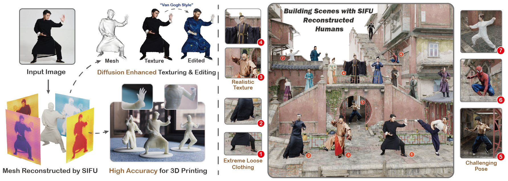

<div align="center">

<h1>SIFU: Side-view Conditioned Implicit Function for Real-world Usable Clothed Human Reconstruction</h1>

<div>
    <a href="https://river-zhang.github.io/zechuanzhang//" target="_blank">Zechuan Zhang</a>&emsp;
    <a href="https://z-x-yang.github.io/" target="_blank">Zongxin Yang</a>&emsp;
    <a href="https://scholar.google.com/citations?user=RMSuNFwAAAAJ&hl=zh-CN&oi=ao" target="_blank">Yi Yang✉</a>&emsp;
</div>
<div>
    ReLER, CCAI, Zhejiang University
</div>
<div>
     <sup>✉</sup>Corresponding Author
</div>
<div>
    <a href="https://river-zhang.github.io/SIFU-projectpage/" target="_blank">CVPR 2024</a>
</div>


<div style="width: 80%; text-align: center; margin:auto;">
    
    <em>Figure 1. With just a single image, SIFU is capable of reconstructing a high-quality 3D clothed human model, making it well-suited for practical applications such as 3D printing and scene creation. At the heart of SIFU is a novel Side-view Conditioned Implicit Function, which is key to enhancing feature extraction and geometric precision. Furthermore, SIFU introduces a 3D Consistent Texture Refinement process, greatly improving texture quality and facilitating texture editing with the help of text-to-image diffusion models. Notably proficient in dealing with complex poses and loose clothing, SIFU stands out as an ideal solution for real-world applications.</em>
</div>

:open_book: For more visual results, go checkout our <a href="https://river-zhang.github.io/SIFU-projectpage/" target="_blank">project page</a>

This repository will contain the official implementation of _SIFU_.


<div align="left">


# News 
- **[2024/2/28]** We release the code of **geometry reconstruction**, including test and inference.
- **[2024/2/27]** SIFU has been accepted by **CVPR 2024**! See you in Seattle!
- **[2023/12/13]** We release the paper on [arXiv](https://arxiv.org/abs/2312.06704).
- **[2023/12/10]** We build the [Project Page](https://river-zhang.github.io/SIFU-projectpage/).

# Installation
- Ubuntu 20 / 18
- **CUDA=11.6, GPU Memory > 16GB**
- Python = 3.8
- PyTorch = 1.13.0 (official [Get Started](https://pytorch.org/get-started/locally/))
- PyTorch3D (official [INSTALL.md](https://github.com/facebookresearch/pytorch3d/blob/main/INSTALL.md), recommend [install-from-local-clone](https://github.com/facebookresearch/pytorch3d/blob/main/INSTALL.md#2-install-from-a-local-clone))


```bash

git clone https://github.com/River-Zhang/SIFU.git
sudo apt-get install libeigen3-dev ffmpeg
cd SIFU
conda env create -f environment.yaml
conda activate sifu
pip install -r requirements.txt

```


Please download the [checkpoint (google drive)](https://drive.google.com/file/d/13rNSmQI_VaMtwlMBSUaxEGybzJEl5KTi/view?usp=sharing) and place them in ./data/ckpt

Please follow [ICON](https://github.com/YuliangXiu/ICON/blob/master/docs/installation.md) to download the extra data, such as HPS and SMPL. There may be missing files about SMPL, and you can download from [here](https://huggingface.co/lilpotat/pytorch3d/tree/main/smpl_data) and put them in /data/smpl_related/smpl_data/.


# Inference


```bash


python -m apps.infer -cfg ./configs/sifu.yaml -gpu 0 -in_dir ./examples -out_dir ./results -loop_smpl 100 -loop_cloth 200 -hps_type pixie

```

# Testing

```bash
# 1. Register at http://icon.is.tue.mpg.de/ or https://cape.is.tue.mpg.de/
# 2. Download CAPE testset
bash fetch_cape.sh 

# evaluation
python -m apps.train -cfg ./configs/train/sifu.yaml -test

# TIP: the default "mcube_res" is 256 in apps/train.
```


# Applications of SIFU

## Scene Building


## 3D Printing


## Texture Editing


## Animation


## In-the-wild Reconstruction


